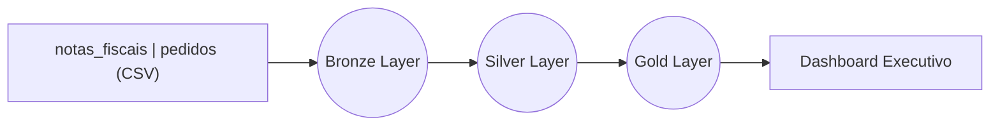

🚗 Projeto de Engenharia de Dados: Indústria Automobilística

📋 Sobre o Projeto

Este projeto é uma solução completa de Engenharia de Dados (End-to-End) desenvolvida no Databricks. O objetivo foi ingerir dados brutos de uma indústria automobilística, tratá-los e criar um Data Lakehouse robusto para alimentar Dashboards Executivos.

O projeto transforma dados operacionais desconexos (Notas Fiscais e Pedidos) em inteligência estratégica para tomada de decisão.

🏗️ Arquitetura (Medallion Architecture)

O pipeline de dados segue a arquitetura Medalhão, garantindo qualidade e governança em cada etapa:

🟤 Camada Bronze (Ingestão)

Ingestão dos arquivos brutos .csv de Pedidos e Notas Fiscais.

Os dados são carregados em seu formato original, sem tratamentos, garantindo o histórico cru (Raw Data).

⚪ Camada Silver (Limpeza e Padronização)

Aqui os dados são refinados para se tornarem confiáveis. As principais transformações foram:

Padronização: Renomeação de colunas do Português para Inglês (Padrão Global). Ex: nr_pedido → order_id.

Limpeza: Remoção de duplicatas e tratamento de espaços em branco em strings (trim, initcap).

Tipagem: Conversão de strings para datas reais (to_date) e tipos numéricos.

Qualidade: Tratamento de valores nulos (fillna) e arredondamento de valores decimais (round(2)).

Persistência: Salvamento em formato Delta particionado por Ano e Mês para performance.

🟡 Camada Gold (Inteligência de Negócio)

Nesta etapa, criamos agregações focadas em responder perguntas de negócio, divididas em 3 pilares estratégicos:

1. Visão Financeira (Fluxo de Caixa) 💰

Focada em dados de Notas Fiscais.

Tabela faturamento_mensal: Responde "A empresa está crescendo?". Agregação temporal para análise de tendência.

Tabela performance_vendedores: Responde "Quem são os top performers?". Ranking baseado em dados reais de faturamento, eliminando "achismos".

2. Visão Comercial (Mercado) 📦

Focada no cruzamento com Pedidos.

Tabela vendas_por_estado: Responde "Qual região sustenta a operação?". Vital para logística e marketing regional.

Tabela mix_produtos: Responde "Quais são os carros-chefe?". Identificação dos grupos de produtos que geram maior receita (Curva Pareto).

3. Eficiência Operacional (Processos) ⚙️

Focada no Status dos Pedidos.

Tabela funil_vendas: Responde "Quanto dinheiro perdemos em cancelamentos?". Monitoramento da conversão de ponta a ponta (Pendente > Convertido > Cancelado).

📊 Dashboard Executivo

O resultado final é um Painel Interativo no Databricks, organizado para leitura executiva:

KPIs de Topo: Faturamento Total e Volume de Vendas (Big Numbers).

Tendência: Gráfico de linha mostrando a evolução financeira histórica.

Comparativo: Ranking de Vendedores e Mix de Produtos.

Geográfico: Mapa de calor de vendas por estado.

Interatividade: Filtros globais por Vendedor, permitindo análises individualizadas.

[Insira aqui um print do seu dashboard se quiser]

🛠️ Tecnologias Utilizadas

Databricks: Plataforma unificada de dados.

PySpark: Processamento de dados em larga escala.

SparkSQL: Consultas e manipulações de dados.

Delta Lake: Formato de armazenamento otimizado e transacional.

🚀 Como Executar

Ingestão: Carregue os arquivos CSV.

Notebook Bronze: Execute o notebook create_objects para criar o schema.

Notebook Silver: Execute o notebook de tratamento para limpar os dados e salvar as tabelas Silver.

Notebook Gold: Execute as agregações de negócio para gerar os KPIs.

Visualização: Conecte as tabelas Gold ao Databricks Dashboard ou Power BI.

✅ O que deu bom
Padronização Global: Conseguimos transformar colunas em português e formatos heterogêneos em um padrão global (Inglês) limpo e unificado.

Performance: A estratégia de particionamento por Ano e Mês na camada Silver otimizou significativamente a escrita e leitura dos dados.

Visibilidade Imediata: A geração das tabelas Gold permitiu criar um dashboard que responde às perguntas de negócio instantaneamente, como o Gráfico de Tendência de Receita.

⚠️ O que deu ruim (Desafios)
Ordenação Temporal: Enfrentamos dificuldade na ordenação cronológica dos gráficos (Ano-Mês). Foi necessário criar uma coluna concatenada "Periodo" e aplicar lógica SQL específica no notebook visual.ipynb para evitar que a linha do tempo ficasse desordenada.

Qualidade dos Dados (Nulos): Alguns campos numéricos essenciais vieram nulos da origem, exigindo tratamento com .na.fill(0) para garantir que as somas e agregações não fossem quebradas.

🔮 O que faríamos diferente (Melhorias Futuras)
Se pudéssemos voltar no tempo ou tivéssemos mais prazo, focaríamos em:

Orquestração Automática: Utilizar o Databricks Workflows para agendar e encadear a execução dos notebooks automaticamente.

Validação de Dados (Data Quality): Implementar uma biblioteca como Great Expectations para validar se os dados estão nulos ou duplicados antes mesmo do processamento iniciar.

CI/CD: Configurar uma esteira de integração contínua ligada ao repositório Git para um versionamento mais ágil e seguro do código.

✒️ Autores

Luan Guedes - Líder [GitHub]() 

Eduardo Borges [Github](https://github.com/Eduardo-Borges18)

Luiz Henrique [LinkedIn](www.linkedin.com/in/luiz-henrique-rocha-silva-450362337)

Ricarodo Siberiano [GitHub](https://github.com/byteric)

Sérgio Chousinho [GitHub](https://github.com/sergiochou)
